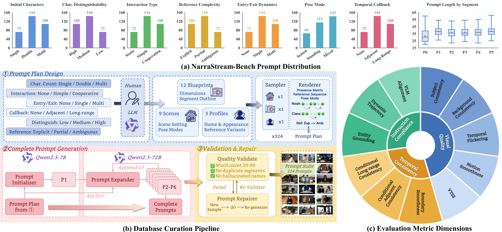

<p align="center" style="border-radius: 10px">
  
</p>

# <div align="center" >Benchmark introduced in "Advancing Narrative Long Video Generation via Training-Free Identity-Aware Memory"<div align="center">

<p align="center">
  <a href="https://eddie0521.github.io/projects/iamflow/"></a>
  &nbsp;
  
  &nbsp;
  <a href="https://huggingface.co/Eddie0521/IAMFlow-FP8"></a>
</p>

## 📷 Introduction
We introduce NarraStream-Bench, a benchmark for narrative streaming video
generation that features 324 multi-prompt scripts spanning six dimensions and a three-dimensional
evaluation protocol that integrates both traditional metrics and multimodal large language model-
based assessment.

## ✨ Highlights

### 1. Overview of NarraStream-Bench

<p align="center">
  
</p>

### 2. Benchmark Comparison

**Comparison of related long-video generation benchmarks.**

| Benchmark | VQ | TC | IC | Prompt Type | Aggregation Strategy | Year |
| --- | --- | --- | --- | --- | --- | --- |
| VBench-Long | ✓ | × | × | Single | Slow-Fast Avg. | 2024 |
| LV-Bench | ✓ | ✓ | × | Single | VDE | 2025 |
| NarrLV | × | ✓ | ✓ | Single | TNA-based QA | 2025 |
| **NarraStream-Bench** | ✓ | ✓ | ✓ | Multi | Narrative-Aware | 2026 |

## 🛠️ Installation
### 1. Install requirements

```
git clone git@github.com:Eddie0521/NarraStream-Bench.git
cd NarraStream-Bench
conda create -n NarraStream-Bench python=3.10
conda activate NarraStream-Bench

# Install a PyTorch build that matches your CUDA/runtime first.
pip install torch torchvision torchaudio --index-url https://download.pytorch.org/whl/cu128
pip install -r requirements.txt
```

### 2. Download checkpoints
Download the metric backbones and auxiliary weights:
``` sh
bash scripts/download_weights.sh
```
By default, checkpoints are saved to ./pretrained and resolved by configs/paths.yaml. Expected checkpoints include CLIP, DINO, RAFT, AMT, VTSS, and LanguageBind video weights.

## 🔑 Usage
### 1. Prepare the api key

NarraStream-Bench uses API-backed MLLM/VLM metrics by default. Set your API key before running the full evaluation:
```
export SILICONFLOW_API_KEY=your_api_key
```

### 2. Prepare the evaluation data
Prepare generated videos and prompts in the following structure:
``` 
your_dataset/
├── prompt.jsonl
└── video/
    ├── sample_0.mp4
    ├── sample_1.mp4
    └── ...
```
Each line in prompt.jsonl should contain one sample:
```json
{"prompts": ["segment prompt 1", "segment prompt 2", "segment prompt 3"]}
```
The number of videos must match the number of prompt samples. If videos are not named as sample_0.mp4, sample_1.mp4, ..., NarraStream-Bench will read all supported video files in natural sorted order.


### 3. Run the command
```sh
bash scripts/run_narrastream_bench.sh \
  --run-name my_eval \
  --video-dir your_dataset/video \
  --prompts your_dataset/prompt.jsonl \
  --gpu-id 0
```
### 4. See the output
Results are saved under `runs/<run-name>/` by default:
```
runs/<run-name>/
├── processed/
│   ├── eval_data.json
│   ├── .preprocess_signature
│   └── sample_*/
│       ├── seg_0.mp4
│       ├── seg_1.mp4
│       └── ...
└── results/
    ├── results_latest.json
    ├── results_YYYYMMDD_HHMMSS.json
    ├── steps/
    ├── raw_metrics/
    └── artifacts/
```
The main files to inspect are:
- results_latest.json: latest resumable snapshot, updated after each metric.
- results_YYYYMMDD_HHMMSS.json: final timestamped result file.
- processed/eval_data.json: preprocessed segment metadata.


## 🌟 Citation
Please leave us a star 🌟 and cite our paper if you find our work helpful.

```
Coming Soon
```
